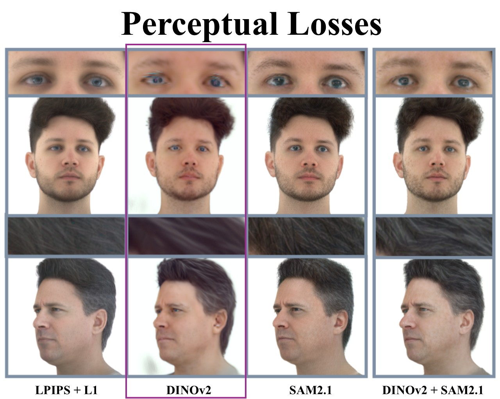

# DINOv2 Perceptual Loss

Still using LPIPS? Try our perceptual loss based on DINOv2 for a more meaningful image supervision of your model!



Implementation from the paper *"PercHead: Perceptual Head Model for Single-Image 3D Head Reconstruction & Editing"* (CVPR '26).  
[[Project Page]](https://antoniooroz.github.io/PercHead/)
[[SAM2.1 Loss]](https://github.com/tobias-kirschstein/sam-loss)


## 1. Installation
```shell
pip install dino_loss
```

## 2. Usage
```python
from dino_loss import DinoV2Loss

dino_criterion = DinoV2Loss()
dino_criterion.compile()  # Optional, for faster loss computation

predicted_images = ... # torch.Tensor [B, 3, H, W] in [0, 1] range
target_images = ... # torch.Tensor [B, 3, H, W] in [0, 1] range
dino_loss = dino_criterion(predicted_images, target_images)
```


If you find this DINOv2 Perceptual Loss useful, please consider citing:
```bibtex
@inproceedings{oroz2026perchead,
  title={Perchead: Perceptual head model for single-image 3d head reconstruction \& editing},
  author={Oroz, Antonio and Nie{\ss}ner, Matthias and Kirschstein, Tobias},
  booktitle={Proceedings of the IEEE/CVF Conference on Computer Vision and Pattern Recognition},
  pages={4097--4108},
  year={2026}
}
```